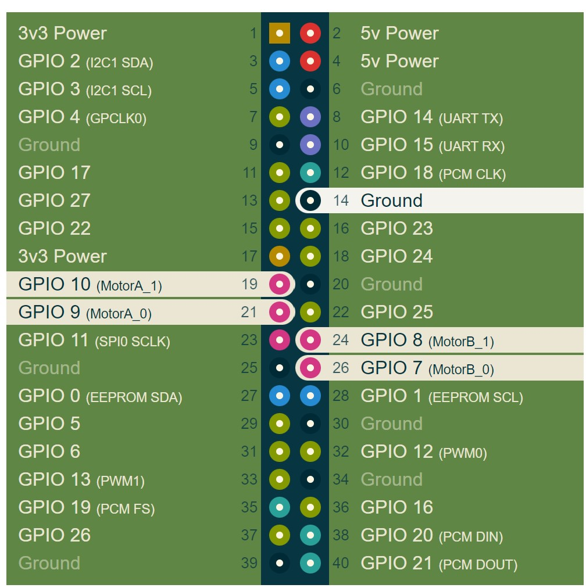
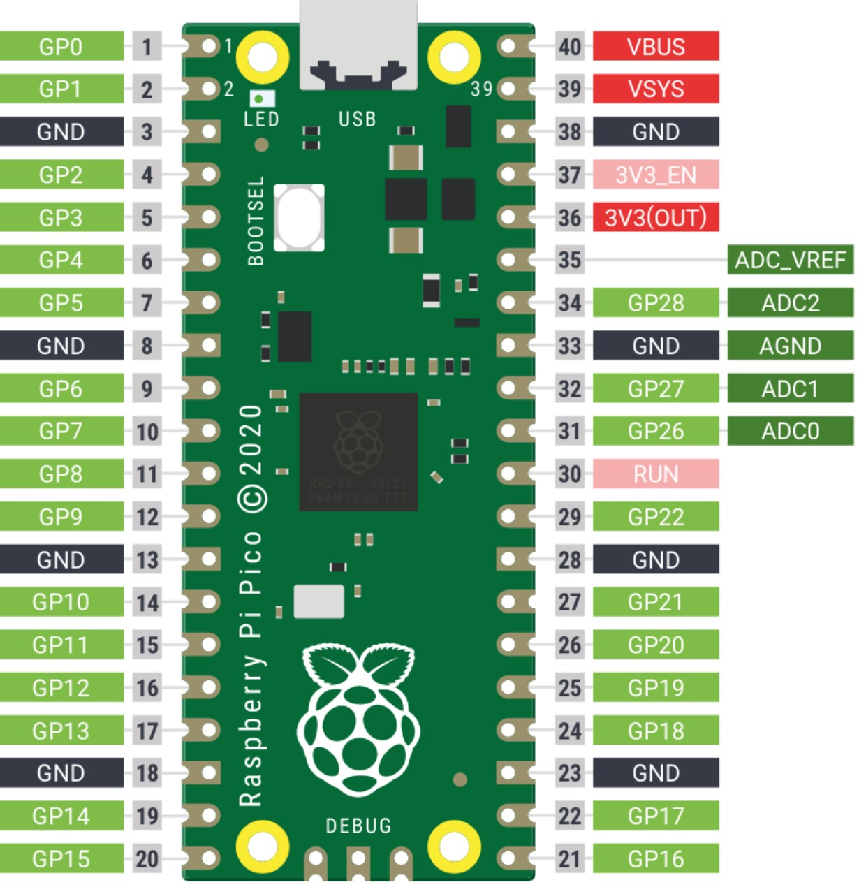

# Camjam_kit3_pico
Discuss issues with porting existing lessons of Camjam motor kit to pico

### Camjam motor controller kit pinouts for RPi

motor A - GP9, GP10

 motor B - GP7, GP8




### Rpi pico pinouts




### motor test code with GPIO zero for Rpi

```python
# Turn all motors off
GPIO.output(7, 0)
GPIO.output(8, 0)
GPIO.output(9, 0)
GPIO.output(10, 0)

# Turn the right motor forwards
GPIO.output(9, 0)
GPIO.output(10, 1)

# Turn the left motor forwards
GPIO.output(7, 0)
GPIO.output(8, 1)
```


### motor test code for pico

Prior to test, need to patch wires from the pico to the controller kit. see [patch wire recommendation](#Patch-wire-recommendation) below.  

To test, install picozero and copy the file pico_jam.py into the /lib directory of pico device.  

use the following test code. the kit should move forward for 1 second then stop. 

```python
import time  # Import the Time library
#from picozero import *
from pico_jam import CamJamKitRobot  # Import the CamJamKit library for pico 

robot = CamJamKitRobot()

# Turn the motors on
robot.forward()

# Wait for 1 seconds
time.sleep(1)

# Turn the motors off
robot.stop()

```

### Electrical interface compatibility issue

From the motor test code with GPIO zero lib, the pins to drive motors are  GP07,GP08 (Left) and GP09,GP10 (Right).

The controller was designed to plug into the expansion port of the RPi.

The Rpi pico has a 40 pin connector with totally different layout compared to that of Rpi. The ground pins do not align with each other. Therefore electrically the pico and Rpi pinouts are incompatible.

The controller with its 26pin connector was designed to work with Rpi and therefore cannot be plugged into the pico.

There are 3 ways to circumvent this issue:

* Design an adapter to translate the pinout of the existing motor kit to match with that of the pico, or
* Patch dupont wires from the motor kit to that of pico, or
* Design a new motor kit specifically for the pico


For hackers, patch is acceptable.

For education to 9 year old, patch is probably not acceptable.

 

### Patch wire recommendation

5 wires had to be connected from the controller to the pico. This arrangement ensures the same GPIO numbers are maintained and therefore the same python code from GPIOzero can be run with Picozero.

| Motor controller | Pico              | Function          |
| ---------------- | ----------------- | ----------------- |
| GPIO 7 (pin 26 ) | GPIO 7  (pin 10)  | motorB_0          |
| GPIO 8 (pin 24 ) | GPIO 8   (pin 11) | motorB_1          |
| GPIO 9 (pin 21 ) | GPIO 9  (pin 12)  | motorA_0          |
| GPIO 10 (pin 19) | GPIO 10 (pin 14)  | motorA_1          |
| GND              | GND  (pin 13)     | electrical ground |
|                  |                   |                   |
|                  |                   |                   |


### Reference

* Picozero - https://github.com/RaspberryPiFoundation/picozero
* Camjam motor kit 3 - https://camjam.me/?page_id=1035
* Camjam motor kit 3 on github - https://github.com/CamJam-EduKit/EduKit3/blob/master/CamJam%20Edukit%203%20-%20RPi.GPIO/Code/3-motors.py


end of this doc

